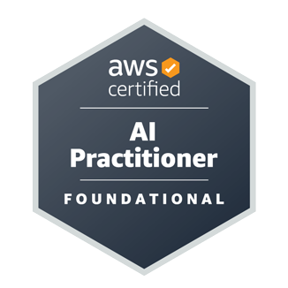

# AWS Certified AI Practitioner (AIF-C01) Study Notes and Practice Tests

- This will help you for quick revision before exam.
- If you are studying for AWS AI Practitioner certifications or you already have them but want to have digital notes of what you studied, here it is and you can come back as many times as you need. I share the notes I used to study and pass my exam.

## Buy this AWS AI Practitioner Study Notes PDF

**[Sample PDF](https://notezio.com/pdfs/AWS-AI-Practitioner-AIF-C01-Study-Notes-Sample.pdf)** &nbsp; &nbsp; &nbsp;
**[Buy Study Notes PDF](https://ko-fi.com/s/88fbf9f485)**

Below Table Link containing information about each sections in details.

## Table of contents

- [AWS Certified AI Practitioner Study Guide](./study-guide.md)
- [Introduction to Cloud Computing and AWS](./section/cloud-computing/cloud-computing.md)
  - What is Cloud Computing?, The Five Characteristics of Cloud Computing, Six Advantages of Cloud Computing, Problems Solved by the Cloud
- **Generative AI and Amazon Bedrock**
  - [GenAI Introduction](./section/gen-ai/genai-introduction.md)
    - What is Generative AI?, What is Foundation Model?, Generative Language Models, GenAI for Images
  - [Amazon Bedrock](./section/gen-ai/amazon-bedrock.md)
    - What is Amazon Bedrock?, Foundation Models, Fine-Tuning a Model, What is RAG (Retrieval-Augmented Generation)?, What is a Vector Database?, RAG vs Fine-Tuning Comparison, Amazon Bedrock Pricing
  - [Prompt Engineering](./section/gen-ai/prompt-engineering.md)
    - What is Prompt Engineering?, Negative Prompting, Prompt Performance Optimization, Prompt Latency, Prompt Engineering Techniques, Prompt Templates
  - [Amazon Q](./section/gen-ai/amazon-q.md)
    - Introduction to Amazon Q, Amazon Q Business, Amazon Q Apps, Amazon Q Developer
  - [AI and Machine Learning Overview](./section/ai-and-ml/ai-and-ml-introduction.md)
    - What is AI?, AI Components, What is Machine Learning (ML)?, What is Deep Leaning(DL)?, What is Generative AI?, What is the Transformer Model? (LLM), Diffusion Models, Multi-Modal Models, Training Data, Supervised Learning, Unsupervised Learning, Semi-Supervised Learning, Self-Supervised Learning, Reinforcement Learning (RL), What is RLHF?, Model Fit, Bias and Variance, Model Evaluation Metrics, Confusion Matrix, Key Classification Metrics, AUC-ROC - Area under the curve-receiver operator curve, Regression Metrics, Metrics for Evaluating LLMs, Inferencing, Phases of a Machine Learning Project, Hyperparameter Tuning, Important Hyperparameters, What to Do If the Model Is Overfitting?

- **AWS Managed AI Services**
  - [Introduction of AWS Managed AI Services](./section/aws-managed-ai-services/introduction-of-aws-managed-ai-services.md)
    - Why Use AWS AI Managed Services?, Examples of AWS AI Managed Services,
  - [Amazon Comprehend](./section/aws-managed-ai-services/aws-comprehend.md)
    - Amazon Comprehend Overview, Why Use Amazon Comprehend?, Custom Classification, Named Entity Recognition (NER), Custom Entity Recognition, Amazon Comprehend Medical
  - [Amazon Translate](./section/aws-managed-ai-services/aws-translate.md)
    - Amazon Translate Overview
  - [Amazon Transcribe](./section/aws-managed-ai-services/aws-transcribe.md)
    - Amazon Transcribe Overview, Improving Accuracy, Toxicity Detection, Amazon Transcribe Medical, Use Cases
  - [Amazon Polly](./section/aws-managed-ai-services/aws-polly.md)
    - Overview, Lexicons, SSML format, Voice engine, Speech Marks
  - [Amazon Rekognition](./section/aws-managed-ai-services/aws-rekognition.md)
    - Amazon Rekognition Overview, Recognition Custom Labels, Content Moderation
  - [Amazon Lex](./section/aws-managed-ai-services/aws-lex.md)
    - Amazon Lex Overview, Workflow
  - [Amazon Personalize](./section/aws-managed-ai-services/aws-personalize.md)
  - [Amazon Textract](./section/aws-managed-ai-services/aws-textract.md)
    - Amazon Textract Overview
  - [Amazon Kendra](./section/aws-managed-ai-services/aws-kendra.md)
    - Amazon Kendra Overview, Key Concepts
  - [Amazon Mechanical Turk](./section/aws-managed-ai-services/aws-mechanical-turk.md)
    - Amazon Mechanical Turk Overview
  - [Amazon Augmented AI (A2I)](./section/aws-managed-ai-services/aws-augmented-ai.md)
    - Amazon Augmented AI (A2I) Overview
  - [Hardware for AI](./section/aws-managed-ai-services/ai-hardware.md)
    - Amazon EC2, Amazon's Hardware for AI
  - [AWS Managed AI Services - Quick Revision Summary](./section/aws-managed-ai-services/aws-ai-services-summary.md)

- [Amazon SageMaker](./section/sagemaker/aws-sagemaker.md)
  - Amazon SageMaker Overview, Built-in ML Algorithms, Automatic Model Tuning (AMT), Model Deployment and Inference, SageMaker Model Deployment Comparison, SageMaker Studio, Data Wrangler, ML Features, SageMaker Feature Store, SageMaker Clarify, SageMaker Ground Truth, ML Governance, SageMaker Model Dashboards, SageMaker Model Monitor, SageMaker Model Registry, SageMaker Pipelines, Pipeline Structure, SageMaker JumpStart, Model Fine-Tuning with JumpStart, SageMaker Canvas, MLFlow for Amazon SageMaker

- **AI Challenges and Responsibilities**
  - [Responsible AI and Security](./section/ai-challenges-and-responsibilities/responsible-ai.md)
    - Responsible AI and Security, core dimensions of responsible AI, AWS services for responsible AI, AWS AI service cards, interpretability vs explainability, high interpretability models – decision trees, partial dependence plots (PDP), human-centered design (HCD) for explainable AI, generative AI: capabilities and challenges
    - [GenAI Capabilities and Challenges](./section/ai-challenges-and-responsibilities/genai-challenges.md)
      - Capabilities of Generative AI, Challenges of Generative AI, Toxicity, Hallucinations, Plagiarism and Cheating, Prompt Misuses
    - [Compliance for AI](./section/ai-challenges-and-responsibilities/compliance.md)
      - Regulated Workloads, AI Standard Compliance Challenges, AWS Compliance, Model Cards
    - [Governance for AI](./section/ai-challenges-and-responsibilities/governance.md)
      - Importance of Governance and Compliance, AI Governance Framework, AWS Tools Supporting AI Governance, Governance Strategies, Data Governance Strategies, Data Management Concepts, Data Lineage
    - [Security and Privacy for AI Systems](./section/ai-challenges-and-responsibilities/security-and-privacy.md)
      - Monitoring AI systems, AWS Shared Responsibility Model, Secure Data Engineering – Best Practices
    - [MLOps (Machine Learning Operations)](./section/ai-challenges-and-responsibilities/mlops.md)
- [**AWS Security Services and more**](./section/aws-security-services/aws-security-services.md)
  - IAM - Identity and Access Management, Amazon S3 - Simple Storage Service, Amazon EC2, AWS Lambda, Amazon Macie, AWS Config, Amazon Inspector, AWS CloudTrail, AWS Artifact, AWS Audit Manager, AWS Trusted Advisor, VPC (Virtual Private Cloud), AWS Services for Bedrock
- [Glossary of AWS AI Practitioner Exam](./glossary.md)

## Free AWS Certified AI Practitioner Exam (AIF-C01) Practice Questions with answers and explanation

- **[Practice Test List](https://notezio.com/aws-certified-ai-practitioner/practice-test/tests/)**

> [!NOTE]
> **Website**: [Notezio - AWS Certified AI Practitioner Study Notes](https://notezio.com/aws-certified-ai-practitioner/)

## Other AWS And Azure Certification Notes

- [AWS Certified Cloud Practitioner (CLF-C01) Study Notes and Practice Tests](https://yareddebela.com/)
- [Microsoft Azure Fundamentals (AZ-900)](https://certification.yareddebela.com/az-900-microsoft-azure-fundamentals/)
- [Useful Cheat Sheet For Developers](https://certification.yareddebela.com/cheat-sheets/)

### If you find the content of this website interesting and helpful, use the “Buy me a Coffee” link below to buy me a coffee

## Star History

# -Aws-certified-ai-practitioner-study-notes-exam-questions-
